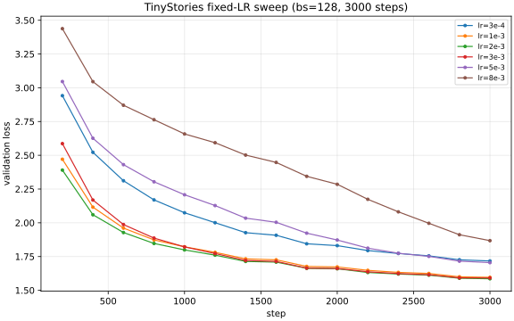
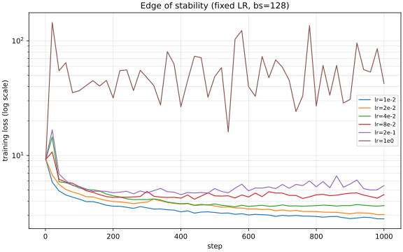

# 7.2 Learning Rate Report

This report covers the `learning_rate` problem using **fixed LR (no LR schedule)** for both:
- part (a) LR sweep
- part (b) edge-of-stability experiments

This report includes the completed 10k-step fixed-LR tuned run for part (a), plus edge-of-stability analysis for part (b).

## Setup

### Model and data

- Train data: `data/tokenized_datasets/tinystories-train.uint16.npy`
- Val data: `data/tokenized_datasets/tinystories-dev.uint16.npy`
- Architecture: `vocab_size=10000`, `context_length=256`, `d_model=512`, `d_ff=1344`, `num_layers=4`, `num_heads=16`, `rope_theta=10000`
- Optimizer: AdamW (`beta1=0.9`, `beta2=0.95`, `eps=1e-8`, `weight_decay=0.1`)
- Gradient clip: `max_grad_norm=1.0`
- Schedule choice: **fixed LR only** (`--lr-schedule fixed`)

### Why fixed LR here

Per the updated plan decision, this experiment intentionally avoids cosine/warmup scheduling so the learning-rate effect is isolated to a single scalar LR value.

## (a) Hyperparameter Sweep Over Learning Rates

### Search strategy

I used a log-spaced LR sweep at `bs=128` over:

`{3e-4, 1e-3, 2e-3, 3e-3, 5e-3, 8e-3}`

Each run used:
- `max_steps=3000`
- `val_every=200` with `val_batches=20`
- identical architecture/optimizer settings

This range brackets the previously strong baseline LR regime while probing higher rates for instability and convergence degradation.

### Sweep results (fixed LR, 3000 steps)

| LR | Best val loss | Final val loss (step 3000) |
|---|---:|---:|
| `3e-4` | `1.717260` | `1.717260` |
| `1e-3` | `1.596057` | `1.596057` |
| `2e-3` | `1.585440` | `1.585440` |
| `3e-3` | `1.591182` | `1.591182` |
| `5e-3` | `1.704770` | `1.704770` |
| `8e-3` | `1.867735` | `1.867735` |

Selected sweep winner: `lr* = 2e-3`.

### Learning curves

### Interpretation

- Loss improves substantially moving from `3e-4` to `2e-3`.
- `2e-3` and `3e-3` are both strong, with `2e-3` slightly better by step 3000.
- Beyond `3e-3`, quality degrades quickly (`5e-3`, `8e-3`).

### Full-budget tuned run result (completed)

Completed run:
- `lr=2e-3`, fixed LR, `max_steps=10000`
- metrics path: `experiments/logs/lr-final-tuned-fixed-lr2e-3.csv`
- checkpoint path: `experiments/checkpoints/tinystories-lr-tuned-fixed.pt`

Final metrics from this 10k run:
- Best val loss: `1.453608` at step `8600` (val perplexity `~4.279`)
- Final val loss: `1.474850` at step `10000` (val perplexity `~4.370`)
- Best train loss: `1.407193` at step `8860`
- Final train loss: `1.464648` at step `10000`
- Runtime: `5279.897s` (`~88.0 min`)

Deliverable check for part (a) target (`val loss <= 1.45`):
- **Not met** in this fixed-LR run (missed by `0.003608`).

## (b) Edge of Stability Analysis

Using the selected `lr*=2e-3`, I ran increasing fixed LRs for 1000-step probes:

`{1e-2, 2e-2, 4e-2, 8e-2, 2e-1, 1e0}`

These correspond to multipliers `{5x, 10x, 20x, 40x, 100x, 500x}` relative to `lr*`.

### Edge probe results

| LR | Best val loss | Final val loss (step 1000) | Behavior |
|---|---:|---:|---|
| `1e-2` | `2.814755` | `2.814755` | Stable but much worse |
| `2e-2` | `3.058480` | `3.058480` | Stable but much worse |
| `4e-2` | `3.602102` | `3.622200` | Stable, poor convergence |
| `8e-2` | `4.308284` | `4.475010` | Stable, very poor |
| `2e-1` | `4.618873` | `5.468183` | Highly unstable trend |
| `1e0` | `21.831630` | `89.852484` | Divergent / exploding loss |

### Edge-of-stability curves

### Relationship between best LR and divergence point

The best sweep LR (`2e-3`) is far below the catastrophic regime (`1e0`), but there is a clear progression:
- as LR increases into `1e-2` to `8e-2`, optimization becomes increasingly noisy and settles at much worse loss
- at `2e-1`, validation becomes erratic and starts drifting upward
- at `1e0`, loss explodes (tens to nearly 90), which is effectively divergent behavior

This is consistent with the "edge of stability" intuition: higher LR can accelerate early movement, but crossing a threshold causes unstable updates that prevent meaningful convergence.

## Deliverables Status

- Learning curves for multiple learning rates: **Done** (`7.2_learning_rate_sweep.svg`)
- Hyperparameter search strategy explanation: **Done** (this report)
- Learning curves including divergent high-LR run: **Done** (`7.2_edge_of_stability.svg`, `lr=1e0` run)
- Analysis of divergence vs convergence: **Done** (section above)
- Model with val loss <= 1.45: **Not met in this run** (best `1.453608` at step `8600`)

