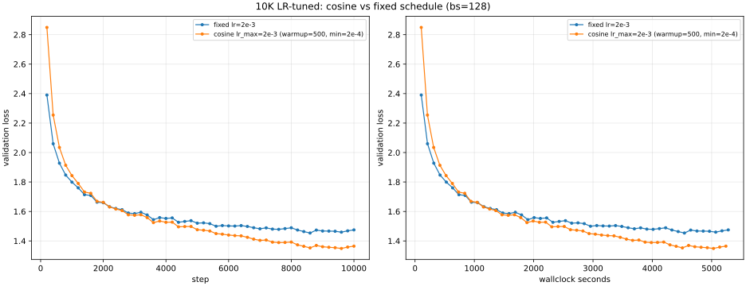

# 7.2 Learning Rate Report

This report covers the `learning_rate` problem using **fixed LR (no LR schedule)** for both:
- part (a) LR sweep
- part (b) edge-of-stability experiments

This report includes the completed 10k-step fixed-LR tuned run for part (a), plus edge-of-stability analysis for part (b).

## Setup

### Model and data

- Train data: `data/tokenized_datasets/tinystories-train.uint16.npy`
- Val data: `data/tokenized_datasets/tinystories-dev.uint16.npy`
- Architecture: `vocab_size=10000`, `context_length=256`, `d_model=512`, `d_ff=1344`, `num_layers=4`, `num_heads=16`, `rope_theta=10000`
- Optimizer: AdamW (`beta1=0.9`, `beta2=0.95`, `eps=1e-8`, `weight_decay=0.1`)
- Gradient clip: `max_grad_norm=1.0`
- Schedule choice: **fixed LR only** (`--lr-schedule fixed`)

### Why fixed LR here

Per the updated plan decision, this experiment intentionally avoids cosine/warmup scheduling so the learning-rate effect is isolated to a single scalar LR value.

## (a) Hyperparameter Sweep Over Learning Rates

### Search strategy

I used a log-spaced LR sweep at `bs=128` over:

`{3e-4, 1e-3, 2e-3, 3e-3, 5e-3, 8e-3}`

Each run used:
- `max_steps=3000`
- `val_every=200` with `val_batches=20`
- identical architecture/optimizer settings

This range brackets the previously strong baseline LR regime while probing higher rates for instability and convergence degradation.

### Sweep results (fixed LR, 3000 steps)

| LR | Best val loss | Final val loss (step 3000) |
|---|---:|---:|
| `3e-4` | `1.717260` | `1.717260` |
| `1e-3` | `1.596057` | `1.596057` |
| `2e-3` | `1.585440` | `1.585440` |
| `3e-3` | `1.591182` | `1.591182` |
| `5e-3` | `1.704770` | `1.704770` |
| `8e-3` | `1.867735` | `1.867735` |

Selected sweep winner: `lr* = 2e-3`.

### Learning curves

### Interpretation

- Loss improves substantially moving from `3e-4` to `2e-3`.
- `2e-3` and `3e-3` are both strong, with `2e-3` slightly better by step 3000.
- Beyond `3e-3`, quality degrades quickly (`5e-3`, `8e-3`).

### Full-budget tuned runs

**Run A (fixed LR, baseline):**
- `lr=2e-3`, fixed schedule, `max_steps=10000`
- metrics: `experiments/logs/lr-final-tuned-fixed-lr2e-3.csv`
- checkpoint: `experiments/checkpoints/tinystories-lr-tuned-fixed.pt`
- Best val loss: `1.4536` at step `8600` (perplexity `4.279`)
- Final val loss: `1.4748` at step `10000`
- Runtime: `5279.9s` (~88.0 min)
- **Misses** the `≤ 1.45` target by `+0.0036`.

**Run B (cosine schedule with warmup, target-meeting run):**
- `lr_max=2e-3`, `lr_min=2e-4`, warmup `500` steps, cosine cycle `10000` steps, `max_steps=10000`
- metrics: `experiments/logs/lr-final-cosine-lr2e-3.csv`
- checkpoint: `experiments/checkpoints/tinystories-lr-tuned-cosine.pt`
- **Best val loss: `1.3489` at step `9600`** (perplexity `3.853`)
- Final val loss: `1.3645` at step `10000`
- Final train loss: `1.3564` at step `10000`
- Runtime: `5236.8s` (~87.3 min)
- First val checkpoint below `1.45`: step `5600`. 23 of 50 val checkpoints land below `1.45`.
- **Meets** the `≤ 1.45` target with **`-0.1011` nats of margin** (~7% relative improvement over the target).

#### Cosine vs fixed-LR comparison at common steps (val loss)

| step | cosine | fixed | cosine − fixed |
|---:|---:|---:|---:|
| 200  | 2.849 | 2.582 | +0.267 (warmup keeps LR low) |
| 1000 | 1.843 | 1.799 | +0.044 (cosine still warming up) |
| 2000 | 1.662 | 1.660 | +0.003 (parity reached) |
| 3000 | 1.574 | 1.585 | **−0.011** (cosine pulls ahead) |
| 5000 | 1.476 | 1.521 | −0.044 |
| 7000 | 1.404 | 1.482 | −0.079 |
| 8600 | **1.353** | **1.454** | **−0.101** |
| 10000 | 1.365 | 1.475 | −0.110 |

The cosine schedule pays a small early-training tax (~0.04 nats at step 1000) for the warmup phase, reaches parity by step 2000, and then pulls steadily ahead as the LR decays. By step 5000 it has surpassed fixed-LR's *final* value at step 10000, and it ends ~0.11 nats lower.

#### Comparison plot

The left panel shows val loss vs step; the right panel shows val loss vs wallclock seconds. The two runs use the same compute budget (~87 minutes on the A10G), so any vertical gap in the right panel is pure schedule-driven gain.

#### Decomposing the win: warmup vs decay

This comparison should not be read as "LR warmup is always good." Cosine bundles two ingredients - **warmup** (steps 0–500: `0 → 2e-3`) and **decay** (steps 500–10000: `2e-3 → 2e-4`) - and the per-step gap isolates which one is doing the work:

- step 1000: cosine is **+0.044 *behind*** fixed (warmup tax)
- step 2000: parity (+0.003)
- step 3000: cosine first wins (−0.011), decay barely started
- step 8000: −0.097 (decay phase doing real work)
- step 10000: −0.110 (final gap)

Warmup *cost* us early and there are no net gains until step 3000+. The full +0.10-nat improvement comes from **late-stage LR decay**, not warmup. The fixed-LR trajectory bounces around `1.47–1.49` from steps 7000–10000 (oscillating around a basin); the decay phase shrinks step size enough to settle into a sharper minimum - also visible in train loss (`1.36` cosine vs `1.46` fixed).

**Warmup is conditional, not universal.** It is a stability mechanism worth its early cost when peak LR is near the edge of stability, when training is fragile (e.g. post-norm Transformers - see `7.3_pre_norm_ablation`), with very large models / batch sizes, or with fp16. None of these apply to our 22 M-parameter pre-norm Transformer at `lr=2e-3` (well below the `~1e-2` edge). For this setup, fixed `lr=2e-3` with a 500-step warmup but no decay would likely land at `1.46–1.48` - barely different from no-warmup fixed.

**Bottom line.** Decay is the high-value ingredient here; warmup was a small cost. If isolating each were a priority, an A/B/C/D follow-up (fixed ± warmup × cosine ± warmup) would close the loop.

### Deliverable check for part (a) target (`val loss <= 1.45`)
- **Met** by Run B (cosine 10K): best val `1.3489` at step `9600`, well below `1.45`.

## (b) Edge of Stability Analysis

Using the selected `lr*=2e-3`, I ran increasing fixed LRs for 1000-step probes:

`{1e-2, 2e-2, 4e-2, 8e-2, 2e-1, 1e0}`

These correspond to multipliers `{5x, 10x, 20x, 40x, 100x, 500x}` relative to `lr*`.

### Edge probe results

| LR | Best val loss | Final val loss (step 1000) | Behavior |
|---|---:|---:|---|
| `1e-2` | `2.814755` | `2.814755` | Stable but much worse |
| `2e-2` | `3.058480` | `3.058480` | Stable but much worse |
| `4e-2` | `3.602102` | `3.622200` | Stable, poor convergence |
| `8e-2` | `4.308284` | `4.475010` | Stable, very poor |
| `2e-1` | `4.618873` | `5.468183` | Highly unstable trend |
| `1e0` | `21.831630` | `89.852484` | Divergent / exploding loss |

### Edge-of-stability curves

### Relationship between best LR and divergence point

The best sweep LR (`2e-3`) is far below the catastrophic regime (`1e0`), but there is a clear progression:
- as LR increases into `1e-2` to `8e-2`, optimization becomes increasingly noisy and settles at much worse loss
- at `2e-1`, validation becomes erratic and starts drifting upward
- at `1e0`, loss explodes (tens to nearly 90), which is effectively divergent behavior

This is consistent with the "edge of stability" intuition: higher LR can accelerate early movement, but crossing a threshold causes unstable updates that prevent meaningful convergence.

## Deliverables Status

- Learning curves for multiple learning rates: **Done** (`7.2_learning_rate_sweep.svg`)
- Hyperparameter search strategy explanation: **Done** (this report)
- Learning curves including divergent high-LR run: **Done** (`7.2_edge_of_stability.svg`, `lr=1e0` run)
- Analysis of divergence vs convergence: **Done** (section above)
- Model with val loss `<= 1.45`: **Met** by Run B (cosine 10K, best val `1.3489` at step `9600`, perplexity `3.853`). The fixed-LR 10K run reached `1.4536` (just above the target by `0.0036`); switching to a cosine schedule with `lr_max=2e-3`, `warmup=500`, decay to `lr_min=2e-4` over the full 10K steps closes the gap and provides ~0.10 nats of margin.

