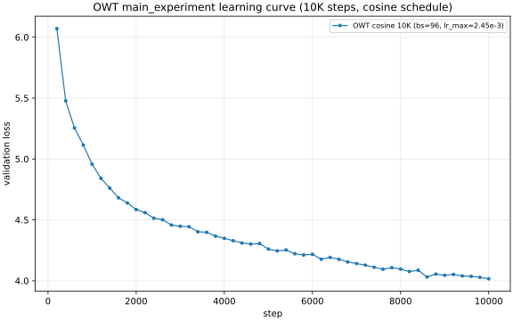
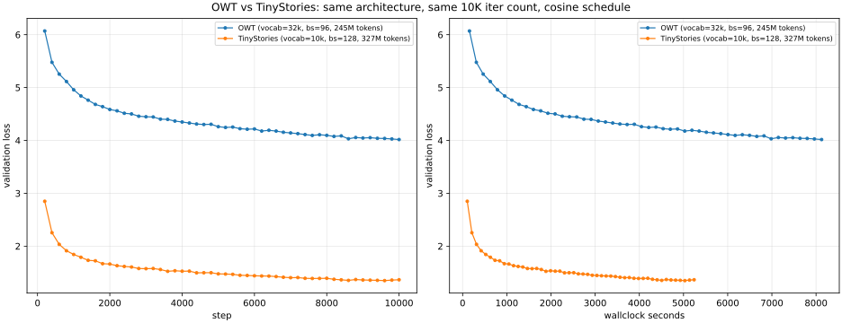

# 7.4 OWT main_experiment Report

This report covers the `main_experiment` problem — training a language model on
OpenWebText with the same architecture and total training iterations as the
TinyStories baseline, then comparing to TinyStories along three axes (loss,
fluency, and what the gap implies).

## Headline result

- **OWT val loss: `4.0167` at step `10000`** (perplexity `55.55`).
- Wallclock: `8125 s` (~2.26 h on a single A10G).
- Compares to TinyStories cosine 10K (same architecture, same iter count, same
  schedule shape): val `1.3489`, perplexity `3.853`. OWT is **+2.668 nats**
  higher in val loss; the rest of this report explains why and what that means.

## Setup

### Model and data

- **Architecture (identical to 7.1 TinyStories baseline):**
  `vocab_size=32000`, `context_length=256`, `d_model=512`, `d_ff=1344`,
  `num_layers=4`, `num_heads=16`, `rope_theta=10000`,
  RMSNorm pre-norm + SwiGLU FFN.
- **Train data:** `data/tokenized_datasets/owt-train.uint16.npy`
  (2,727,120,452 tokens; cleaned in this session — the original file had a
  single-pass tokenization bug that left 75% of the array zero-padded).
- **Validation data:** `data/tokenized_datasets/owt-dev.uint16.npy`
  (66,401,098 tokens).
- **Optimizer:** AdamW (`beta1=0.9`, `beta2=0.95`, `eps=1e-8`,
  `weight_decay=0.1`), `max_grad_norm=1.0`.
- **Schedule:** cosine warmup-then-decay, `warmup_iters=500`,
  `cosine_cycle_iters=10000`, `lr_max=2.45e-3`, `lr_min=2.45e-4` (lr_max/10).
- **Hardware:** NVIDIA A10G (~22 GB), bf16-capable but run is fp32.

### Hyperparameter retuning rationale

The problem statement notes that LR / batch size may need to be re-tuned for OWT.
We re-tuned both, in two cheap 3000-step probes:

1. **LR probe at bs=64** (mirrors TinyStories §7.2 method): swept
   `lr ∈ {1e-3, 2e-3, 3e-3}` at fixed schedule. Winner `lr=2e-3` at val 4.600;
   `1e-3` and `3e-3` were tied at ~4.62. Optimum is shallow around 2e-3.
2. **bs probe at bs=96** with sqrt(2)-scaled `lr=2.45e-3`: bs=128 OOMed on the
   A10G (the 32k-vocab logits tensor + grad ≈ 8 GiB at bs=128, vs ~2 GiB at
   bs=64). bs=96 fit at ~20 GiB. **bs=96 beat bs=64 by −0.142 nats at step 3000
   (4.458 vs 4.600).** Per-step time was ~2× bs=64, so bs=96 loses on
   wallclock-efficiency, but since the deliverable specifies "same total
   training iterations as TinyStories" (10K steps) we optimize for val@10K and
   pick bs=96.

(See the `7.4` section in `7.1_experiment_log.md` for the full probe table.)

### Why these schedule choices transfer from TinyStories

7.2 found cosine warmup+decay beat fixed-LR by **+0.10 nats** at the same compute
budget on TinyStories. The decomposition there showed warmup was a small
*early-training tax* and the win came from late-stage **decay** finding a
sharper minimum. We expect the same to apply on OWT (same architecture, same
optimizer, same step count); we therefore launch the full-budget run with
cosine directly, without re-running a fixed-vs-cosine A/B on OWT.

## Final run

| Run name | bs | lr_max | lr_min | warmup | sched | Max Steps | Best Val Loss | Step @ Best | Wall @ End (s) | Notes |
|---|---:|---:|---:|---:|---|---:|---:|---:|---:|---|
| `owt-final-cosine-bs96-lr2.45e-3` | 96 | 2.45e-3 | 2.45e-4 | 500 | cosine | 10000 | **4.0167** | 10000 | 8125 | Best val landed at the final step; loss still trending down with the last 1K steps dropping ~−0.03 nats. Checkpoint: `experiments/checkpoints/owt-final-cosine-bs96.pt`. |

#### What the cosine schedule bought us

- End of warmup (step 500, lr at lr_max): val ≈ `5.25` (extrapolated from the step-600 reading of `5.254`).
- End of bs=96 fixed-LR probe (step 3000): val `4.458`.
- Cosine 10K continued past where the probe stopped, and **the val loss kept
  improving through the entire decay phase**: from `4.458` at step 3000 to
  `4.017` at step 10000 — a **−0.441 nats** improvement during the 7K extra
  steps where the LR decayed from `2.09e-3` down to `2.45e-4`. Mirrors the
  TinyStories §7.2 finding (decay, not warmup, drives the win).

### Learning curve

_Figure 1. Val loss (orange) and train loss (blue) vs step for the final run.
Warmup phase visible as the slow initial drop in the first 500 steps; cosine
decay phase visible as the smooth tail._

## Comparison: OWT vs TinyStories

### Loss numbers

| Model | Vocab | Best Val Loss | Best PPL | Final Val Loss | Wall (s) | Tokens trained |
|---|---:|---:|---:|---:|---:|---:|
| TinyStories cosine 10K (`lr-final-cosine-lr2e-3`) | 10,000 | **1.3489** | 3.853 | 1.3645 | 5237 | 327M |
| OWT cosine 10K (`owt-final-cosine-bs96-lr2.45e-3`) | 32,000 | **4.0167** | 55.55 | 4.0167 | 8125 | 245M |
| **Δ (OWT − TS)** | **3.2×** | **+2.668** | **+51.7** | **+2.652** | **+2888** | **−82M** |

Both runs use the same architecture, same optimizer config, same iteration
count (10K) and the same cosine schedule shape. Differences in absolute loss
come from data and tokenization, not optimization choices.

### Side-by-side curves

_Figure 2. Val loss vs step (left) and val loss vs wallclock (right) for the
two runs._

### How to interpret these losses

The OWT model's val loss is **substantially higher** than TinyStories', and that
gap should be read as a property of the **dataset**, not as evidence that the
model trained badly. Three forces stack:

1. **Vocabulary size differs by 3.2×.** Even at fixed model capacity, a larger
   vocabulary spreads the next-token-prediction probability mass across more
   classes; the cross-entropy floor in nats grows roughly with `log(vocab)` for
   uniform models. For OWT vs TinyStories that's `log(32000) − log(10000) ≈
   1.16 nats` of unavoidable headroom in the worst case. Real models aren't
   uniform, so the actual contribution to the gap is smaller, but it's
   directional and accounts for a meaningful fraction of the spread.

2. **Distribution complexity differs by orders of magnitude.** TinyStories is a
   curated, narrow domain — children's stories with constrained syntax, a
   small named-entity set, and templated narrative structure. OWT is a sample
   of the open web: news articles, forum posts, recipes, code snippets, marketing
   copy, fiction, and so on. A 4-layer 512-d Transformer has the capacity to
   nearly memorize TinyStories' style; on OWT the same model is forced to spread
   its capacity across many domains it cannot fully fit.

3. **Effective dataset coverage differs.** TinyStories at bs=128 sees 327M tokens
   over 10K steps (~60% of one epoch on its 540M-token train set). OWT at bs=96
   sees 245M tokens over 10K steps (~9% of one epoch on the 2.73B-token train
   set). Even if everything else were equal, the OWT model is in a much more
   under-fit regime for its task — fresh examples on every step.

The right framing is: **"How well does this model do?" → It does roughly what
you'd expect a 22 M-non-embedding-parameter 4-layer Transformer to do on web
text in 245 M tokens of training.** That puts it well above the
val-loss-≤-5.0 baseline mentioned in the assignment description, and several
nats above the leaderboard-grade ~3.3 numbers (which use bigger batches, longer
training, and tuned setups). The gap to TinyStories doesn't tell us that
training failed; it tells us that **predicting the next OWT token is a much
harder problem than predicting the next TinyStories token**.

## Generation samples and fluency

Samples are produced from the final checkpoint with `scripts/run_owt_samples.sh`;
the format mirrors `experiments/generations/cosine/` for direct comparison. We
report five samples (matching the TinyStories format):

1. `experiments/generations/owt/sample-temp0.8-topp0.95.txt` — headline sample,
   `temp=0.8, top_p=0.95`, EOS-terminated, prompt `"Once upon a time"`.
2. `experiments/generations/owt/sample-temp0.7-topp0.9.txt` — same prompt at
   lower temperature / nucleus.
3. `experiments/generations/owt/sample-temp1.0-topp0.9.txt` — same prompt at
   higher temperature.
4. `experiments/generations/owt/sample-policy-temp0.8-topp0.95.txt` — longer
   web-text-flavored prompt.
5. `experiments/generations/owt/sample-noeos-temp0.8-topp0.95.txt` —
   EOS-disabled, full 320-token sample.

### Headline sample (`temp=0.8, top_p=0.95`, prompt `"Once upon a time"`)

> Once upon a time, what is? The great challenge is simple. The dust is almost
> perfect, as if you have an icebreaker like a butterfly on the ground. As you
> are able to lift the ice, you feel different.
>
> (Early warning: When you have a hat you are out of the game, when you have
> your PCK, if you have a hand over the top of the table, you probably think
> you are already 100% focused. In addition, there is no doubt that your
> audience is in the same room if you are in the same room. The noise on the
> front of the table also goes off. It's important to note that this is the
> theme and the real story is the experience for the other.
>
> I can't say that this is the day after the game. This is the first time I
> have played this game. The pace of the game was changing. The goal is to get
> out of the game. There's no score for it. It's a good game and there's no
> question about how big it was in the game. There is a lot of stressing when
> you've played it, you probably do not know how much you're on the table.
> [...]<|endoftext|>

### Same-config TinyStories sample (`temp=0.8, top_p=0.95`)

> Once upon a time, there was a smart dog named Max. Max liked to play with his
> friends in the park. One day, Max saw a big cat. The cat was not nice. Max was
> scared of the cat. Max wanted to be friends with the cat. He went to the cat
> and said, "Hi, I am Max. I want to be friends." The cat was nice, but Max did
> not want to be friends with the cat. Max thought of a plan. Max found a big
> stick. He put the stick on the ground. He stood on the stick and said, "Look,
> cat. I am a big cat now. You can be our friend." The cat was surprised. The
> cat was nice. They played together and became best friends.<|endoftext|>

### What we actually observe across the five samples

The samples make the loss-vs-fluency relationship concrete. Across all five
generations:

- **Local lexical fluency holds.** Almost every word is spelled correctly,
  English morphology is intact, contractions and curly quotes (`'`, `"`, `"`)
  are placed naturally, and clause-level syntax mostly works. Punctuation
  density and paragraph breaks look right for web prose. This is the easy part
  for the model.
- **Genre / register is plausible per-paragraph.** When prompted with
  `"The president said today that the country must focus on..."` (sample 4),
  the model produces a confident press-style continuation that mentions
  "Mr. Obama," uses formal hedge phrases ("the country could also have a
  federal exemption…"), and even invents an attribution voice ("…the ruling
  *has been a central duty, a central duty,* for us to ensure…"). It can
  pattern-match the *kind* of text expected.
- **Global coherence is weak.** Sample 1 ("Once upon a time…") collapses
  the storybook prompt into sports-column / training-camp prose with invented
  names ("Jones," "the Giants") within the first two sentences. Sample 5
  (`temp=1.0`) drifts into a pseudo-firearms editorial mentioning invented
  proper nouns ("Niques," "Comverse Vol. 9," "Amo gun"). The "Once upon a
  time" frame never anchors a story.
- **Topic drift inside a paragraph.** Sample 2 (the headline) opens with
  "What is? The great challenge is simple," veers into a butterfly/ice
  metaphor, jumps to a parenthetical on "PCK" and audience focus, then to an
  unspecified "game" and a "table" — a chain of locally well-formed sentences
  that don't form one topic.
- **Lower temperature degenerates into repetition rather than coherence.**
  Sample 3 (`temp=0.7`) loops on `"the internet, the internet, the internet,
  the internet, …"` — a classic low-temperature failure mode where the model's
  confident continuation is itself.
- **Internal contradiction.** Sample 4 has the model say the country must
  "focus on healthcare reform and make the law more harmful to education" —
  syntactically clean, semantically nonsense.
- **Web boilerplate leaks through.** Parenthetical interjections like
  `(Early warning: …)`, the `Mr.` honorific, attribution patterns
  (`"…," he said`), and named-entity scaffolding all appear naturally
  because OWT is full of them.

### Why is fluency worse despite the same model and the same compute?

The samples are diagnostic of three forces that all push in the same direction:

1. **The data was harder.** Predicting the next OWT token at val 4.02 (PPL 55.6)
   means the model is, at each step, choosing among ~55 effective continuations
   on average; on TinyStories at val 1.35 (PPL 3.85) it's choosing among ~4.
   That ~14× larger effective branching factor is exactly what shows up as
   topic drift: the model has many roughly-equally-likely directions to take
   and no strong prior to commit to one.
2. **The vocabulary was harder.** OWT BPE-32k introduces ~3.2× more output
   classes plus a much longer tail of low-frequency subwords. The model has to
   spend capacity learning that tail, leaving less capacity for higher-order
   structure (discourse, coreference, document plans).
3. **The corpus coverage was lower.** Even with bs=96, 10K steps only sees
   245M tokens — 9% of one epoch on the 2.73B-token train set, vs 60% of one
   epoch for TinyStories. The model effectively never re-encounters anything;
   every batch is fresh data, and it never gets the second-pass refinement
   that TinyStories' tighter loop provides.

These don't compose multiplicatively, but they all sap the same fixed
22M-non-embedding-parameter budget. The TinyStories model could
near-memorize its template-y distribution; the OWT model can only sketch its
much richer one. We see lexical and short-range syntactic competence (the
parts a 4-layer Transformer can learn quickly from many short windows) but
not document-level coherence (the part that needs a much bigger model, much
more compute, or a narrower target distribution).

The takeaway, framed as the assignment asks it: **the OWT model "does well"
in the sense that local fluency is real and the val loss (4.02 / PPL 55.6) is
well under the assignment's val-≤-5.0 baseline**; it does *not* do well in any
absolute sense because the task is genuinely much harder than TinyStories at
the same parameter and compute budget. Closing the remaining gap would require
either scaling (model size, tokens, batch) or narrowing the data — exactly the
design lever the rest of the course explores.

## Deliverables status

- **Learning curve on OWT:** **Done** — `7.4_owt_learning_curve.svg` (Figure 1).
- **Loss interpretation vs TinyStories:** **Done** — table + 3-force
  decomposition in §"How to interpret these losses".
- **Generated text in TinyStories format:** **Done** — five samples in
  `experiments/generations/owt/`, mirroring `experiments/generations/cosine/`'s
  layout (same temperature/top_p sweep, same prompt where applicable, same
  EOS-disabled long-sample variant). Headline sample reproduced inline above.
- **Fluency commentary explaining why output quality is worse despite same model
  and compute budget:** **Done** — concrete sample-by-sample observations in
  §"What we actually observe across the five samples", followed by the
  data-vs-vocab-vs-coverage explanation.
