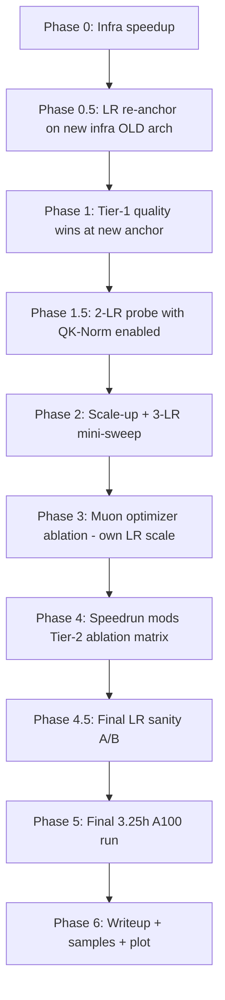

# 7.5 Leaderboard Speedrun Plan

Maximum-effort 7.5 leaderboard plan: layer NanoGPT-speedrun-style modifications onto the existing TransformerLM, validate each cheaply on TinyStories / a small OWT subset, then do a single ~3.25h A100-40GB final run (matching the 1.5h H100 compute envelope) on full OWT.

## Phase summary

| ID | Phase | Purpose | Status |
|---|---|---|---|
| 0 | Infra speedup | Add bf16 autocast, torch.compile, SDPA wrapper, TF32 + cudnn-benchmark, pinned-memory prefetch; verify identical val loss with 4–8x throughput on a 200-step probe. | **DONE** (220K tok/s; 7.32× A10G) |
| 0.5 | LR re-anchor | Sweep `lr ∈ {1e-3, 2e-3, 4e-3}` × 1500 steps on OLD architecture with NEW infra. Pick the new anchor LR for downstream phases. | **DONE** (anchor=2e-3) |
| 1 | Tier-1 modules | Implement QKNorm, weight tying with reduced embed init std, logit soft-cap, z-loss in `transformer.py` / `nn.py` + add CLI flags + lightweight tests. | **DONE** |
| 1 | Tier-1 probes | At the new anchor LR from Phase 0.5, A/B each Tier-1 mod (weight tying, QK-Norm, soft-cap, z-loss, embed-init-std) on TinyStories or OWT subset. Fold non-regressing mods into defaults. | **DONE** (kept: tie + qknorm + softcap + zloss; dropped: embedinit alone) |
| 1.5 | QK-Norm LR re-anchor | With QK-Norm enabled, sweep `lr ∈ {anchor, 2x, 4x}` × 1500 steps. Adopt the QK-Norm-aware LR for Phases 2–4. | **DONE** (anchor stays at 2e-3; cumulative Tier-1 stack at -0.082 nats vs Phase 0.5) |
| 2 | Scale-up | Probe `(d, L, bs, ctx)` scaling on small OWT subset; pick the size that uses ~all of the 11700s budget at ~30–60K steps. 3-LR mini-sweep around `(anchor / sqrt(d_new/512))`. | **DONE** (winner: d=1024 L=8 bs=96 lr=1.0e-3; val@2000 = 4.3077; -0.285 nats vs Phase 0.5) |
| 3 | Muon optimizer | Implement Muon + param-group splitter; A/B Muon-on-hidden vs AdamW-everywhere on OWT subset. If Muon wins, 2-LR sweep for Muon's hidden LR (Muon LR scale ~10–50x AdamW). | **DONE** (Muon-mixed muon-lr=0.02 wins by -0.190 nats vs AdamW; cumulative -0.558 vs Phase 0.5) |
| 4 | Speedrun mods | Implement ReLU² FFN, value embeddings/skip connection, WSD schedule, ctx=1024 path; cumulative greedy ablation matrix on OWT subset starting from Phase-3 winner. | pending |
| 4.5 | Final LR sanity A/B | At ±sqrt(2) around the Phase-4 winner LR for 1500 steps on OWT subset. If shifted, adopt the better one for the final run. | pending |
| 5 | Final run | ~3.25h A100-40GB run (compute-equivalent to 1.5h H100) with the cumulative-best config; write checkpoint + csv + console log; check wallclock ≤ 11700s. | pending |
| 6 | Writeup | Generate text samples, plot wallclock-axis learning curve, write `7.5_leaderboard_report.md` with final val loss, ablation table, hardware note, samples. | pending |

## 1. Goal and constraints

- Beat naive 5.0 baseline by as wide a margin as possible. Existing 7.4 baseline (4-layer/512d, 245M tokens, ~2.26h on A10G) reached val 4.02 — that's the bar to clear under the same compute envelope with all the speedrun upgrades.
- Leaderboard rule: 1.5h on H100 (bf16 dense, no FP8 assumed). Public benchmarks put H100 ≈ **2.0–2.5x** A100-40GB on small Transformers in bf16, so we treat **3.25h ≈ 11700s on A100-40GB as the compute-equivalent budget** for the final run. (1.5h literal-A100 would be ~half the intended compute envelope; we explicitly avoid that.)
- Hardware: single A100-40GB for both development and the final run. Writeup will note the hardware substitution and the conversion factor used.
- Data: only `data/tokenized_datasets/owt-train.uint16.npy`. Validation only on `owt-dev.uint16.npy`.
- All experiments use existing `scripts/train_lm.py` infrastructure (csv logging + checkpoint + cosine schedule).

## 2. Modifications to implement

Grouped by ROI tier (do all of Tier 0 + 1; ablate Tier 2 cheaply; pick winners).

### Tier 0 — infrastructure (free 5–10x throughput, no quality change expected)

- **bf16 mixed precision** via `torch.autocast(device_type="cuda", dtype=torch.bfloat16)` around forward/backward. Keep params fp32, optimizer states fp32, autocast only the math.
- **torch.compile(model, mode="reduce-overhead")** on the inner step. Verify recompilation triggers don't fire mid-training.
- **`F.scaled_dot_product_attention`** as the attention kernel (Flash-Attention 2 backend). Replace [`scaled_dot_product_attention` in `cs336_basics/transformer.py`](../../cs336_basics/transformer.py) with an SDPA-backed path gated by `--use-sdpa`.
- **`torch.set_float32_matmul_precision("high")`** + enable cuDNN benchmark.
- Pinned-memory async dataloader prefetch for `get_batch` so we overlap the next batch with the current step.

### Tier 1 — well-validated quality wins (apply by default)

- **Weight tying** between `token_embeddings.weight` and `lm_head.weight`. Reduces params by ~16M for vocab=32k/d=512 → frees memory for bigger model. Halve the embedding init std as suggested (use `std = 1/sqrt(d_model)` Llama-style instead of N(0,1)).
- **QK-Norm**: RMSNorm applied per-head to Q and K *after* RoPE, *before* the attention dot product. Stabilizes high-LR training. Add a `QKNorm` module and wire into `CausalMultiHeadSelfAttention`.
- **Logit soft-cap**: `tanh(logits / cap) * cap` with `cap=30`. Standard Gemma-2-style stabilizer for large-vocab heads.
- **Z-loss** (small auxiliary loss on `(logsumexp(logits))^2 * 1e-4`) — keeps logits well-scaled, especially with bf16.

### Tier 2 — speedrun-style experimental wins (ablate, keep if positive)

- **Muon optimizer** on hidden-weight matrices (every Linear except embeddings, lm_head, biases, norms — those stay on AdamW). Newton-Schulz iteration to orthogonalize the momentum buffer. Reference: NanoGPT speedrun. Big upside reported for small models at this scale.
- **ReLU² FFN** as alternative `--ffn-type relu2` (squared ReLU, no gating, `d_ff = 4*d_model`). Speedrun shows this beats SwiGLU for small models.
- **Value embeddings / skip connection**: Add a learned token-id embedding directly into the residual stream at layer ~N/2 and at the final pre-LMhead point (NanoGPT speedrun "U-net"-style skip).
- **Untied final norm**: keep RMSNorm on residual but disable learned gain on intermediate norms (lower-variance init).
- **WSD schedule**: `--lr-schedule wsd` with linear warmup → flat at lr_max → linear decay to 0 in last 20% of steps. Cleaner than cosine and easy to tune the decay window.
- **Longer context**: 256 → 512 (sees 2x more tokens per step, attn cost is `O(L^2)` so still fits under bf16/SDPA).
- **Larger batch**: A100-40GB headroom lets us push bs and benefit from larger optimal LR (sqrt-scaling rule).

### Tier 3 — try if time permits

- GQA (group-query attention) — reduces param/mem for K/V projections; minor at this scale.
- Document-causal mask using `<|endoftext|>` boundaries — minor since tokens are already shuffled.
- Higher AdamW β2 (0.95 → 0.97) — sometimes helps long runs.

## 3. File-level implementation map

### [`cs336_basics/transformer.py`](../../cs336_basics/transformer.py)
- Add `sdpa_attention(Q, K, V, is_causal: bool)` thin wrapper around `F.scaled_dot_product_attention`. Keep the original `scaled_dot_product_attention` for backwards-compat / tests.
- Add `QKNorm(nn.Module)` (RMSNorm over `head_dim`).
- Modify `CausalMultiHeadSelfAttention.__init__` to take `use_sdpa: bool` and `qk_norm: bool` kwargs; in `forward`, optionally normalize Q/K post-RoPE, then call the SDPA wrapper or the existing einsum path.
- Add `ReLU2FeedForward(nn.Module)` (no gate, squared ReLU, `W2(ReLU(W1 x)^2)`).
- Modify `TransformerBlock` and `TransformerLM` to accept `use_sdpa`, `qk_norm`, `ffn_type ∈ {swiglu, silu, relu2}`, `tie_embeddings: bool`, `embed_init_std: float | None`, `logit_soft_cap: float | None`, `value_embed_layers: list[int] | None`.
- In `TransformerLM`, if `tie_embeddings`: skip building `lm_head` and use `F.linear(x, self.token_embeddings.weight)` in forward.
- Apply `tanh` soft-cap to logits if `logit_soft_cap is not None`.
- Lower default embed init std when tying (`1/sqrt(d_model)` instead of N(0,1)).

### [`cs336_basics/optim.py`](../../cs336_basics/optim.py)
- Add `Muon(torch.optim.Optimizer)` implementing the NanoGPT speedrun version: momentum SGD + Newton-Schulz orthogonalization (5 iterations) on the update direction, applied only to ≥2D weight matrices excluding embeddings/lm_head.
- Add a `build_param_groups(model, *, hidden_optim="muon", other_optim="adamw")` helper that splits params by tensor shape/role. AdamW handles 1D params (norms, biases) and the embedding/lm_head; Muon handles the rest.
- Add WSD schedule: `lr_wsd_schedule(it, max_lr, warmup, total, decay_frac=0.2)`.

### [`cs336_basics/nn.py`](../../cs336_basics/nn.py)
- Add `cross_entropy_with_z_loss(logits, targets, z_weight=1e-4)` returning `(ce, total)`; total includes `z_weight * (logsumexp(logits))^2`. Backwards-compat: `cross_entropy` keeps old signature.

### [`cs336_basics/data.py`](../../cs336_basics/data.py)
- Add `AsyncBatchPrefetcher` that wraps `get_batch` in a `concurrent.futures.ThreadPoolExecutor` with one queued batch on pinned memory; called from train loop instead of inline `get_batch`.

### [`scripts/train_lm.py`](../../scripts/train_lm.py)
- Add CLI flags: `--bf16`, `--torch-compile`, `--use-sdpa`, `--qk-norm`, `--tie-embeddings`, `--embed-init-std`, `--logit-soft-cap`, `--z-loss-weight`, `--ffn-type relu2`, `--lr-schedule wsd`, `--decay-frac`, `--optimizer {adamw, muon_mixed}`, `--prefetch`, `--value-embed-layers`.
- Wrap forward+loss in `torch.autocast` when `--bf16`.
- After model construction, optionally `model = torch.compile(model)`.
- Build optimizer via the new `build_param_groups` helper when `--optimizer muon_mixed`.
- Use the prefetcher when `--prefetch`.

### `scripts/run_owt_leaderboard_phaseN.sh` (new — one per phase below)

### [`tests/test_transformer_ablations.py`](../../tests/test_transformer_ablations.py)
- Add construction/forward-shape tests for: `qk_norm=True`, `tie_embeddings=True`, `ffn_type="relu2"`, `logit_soft_cap=30`, `use_sdpa=True`. Keep them lightweight (CPU, tiny shapes).

### [`tests/test_optimizer.py`](../../tests/test_optimizer.py)
- Add 1-step parameter-update sanity test for `Muon` on a 2D weight (verify orthogonalization preserves shape and reduces a quadratic loss).

## 4. Experimentation strategy (cheap-probe → final run)

LR re-anchoring is interleaved between phases that change the loss landscape (new infra, new arch with QK-Norm, new optimizer, new mods stack). Total LR-tuning overhead: ~3.2h of A100 probes, well worth de-risking the 3.25h final run.

### Phase 0 — infrastructure (verify only, no quality regression) — **DONE**
- 200-step TinyStories + 200-step OWT runs at fixed seed comparing val loss before/after each of {`--bf16`, `--use-sdpa`, `--torch-compile`}. Expect identical loss within ±0.005 nats and 4–8x more tokens/sec.
- Produce a tokens/sec baseline number for A100 with the existing 4-layer/512d/ctx256/bs96 config.
- **Result (see [`7.1_experiment_log.md`](./7.1_experiment_log.md) §7.5 Phase 0):** at bs=96/ctx=256/d=512/L=4 on A100-40GB:
  - fp32 + TF32 anchor: **139,680 tok/s** (4.66× the A10G fp32 baseline)
  - +SDPA: 160,889 tok/s (1.15× anchor)
  - +SDPA +compile: 179,653 tok/s (1.29× anchor)
  - **+SDPA +compile +bf16: 219,602 tok/s (1.57× anchor; 7.32× A10G)** — full Phase-0 stack
  - Val-loss drift across all stacks ≤ +0.025 nats at step 200 (within numerical-noise envelope at this step count).
- A100/A100-fp32 uplift is only 1.57× (vs the 4–8× plan target) because the fp32 baseline already uses TF32 matmul, which captures most of A100's matmul advantage. Workload is memory-bound at bs=96/ctx=256; Phase 2 scale-up will widen the bf16 win.
- Driver: [`scripts/run_phase0_infra_probe.sh`](../../scripts/run_phase0_infra_probe.sh).

### Phase 0.5 — LR re-anchor on new infra (~30–45 min total) — **DONE**
- Why: the A10G `2e-3` anchor was tied to A10G + fp32 + bs=96. Before stacking arch mods, isolate the infra effect on the LR landscape so subsequent phases are interpretable.
- Setup: OLD architecture (4-layer/512d/ctx=256, AdamW, no Tier-1 or Tier-2 mods), NEW infra (A100 + bf16 + SDPA + compile), same OWT subset.
- Sweep: `lr ∈ {1e-3, 2e-3, 4e-3}` × 1500 steps each.
- Decision: pick the LR with lowest val loss as the new "anchor LR" used by Phase 1.
- Expected: 2e-3 still wins or 4e-3 marginally beats it; if 1e-3 wins something is wrong with the new infra.
- **Result (8.7 min wallclock at ~235K tok/s):** val@1500 — 1e-3: 4.7149, **2e-3: 4.6744 (winner)**, 4e-3: 4.8949. Same ranking and same winner as the A10G probe; 2e-3 is the **anchor LR for Phase 1+**. Driver: [`scripts/run_phase05_lr_reanchor.sh`](../../scripts/run_phase05_lr_reanchor.sh).

### Phase 1 — Tier 1 quality wins on TinyStories (cheap; 1500 steps each, at Phase-0.5 anchor LR)
- Train baseline arch on TinyStories at the **Phase-0.5 anchor LR**, then re-run with each of: weight tying, QK-Norm, logit soft-cap, z-loss, embed-init-std=1/sqrt(d). Target: each non-regression at ≤30 minutes A100.
- Pick all that don't regress; fold them into `defaults` for the next phase.

### Phase 1.5 — QK-Norm-aware LR probe (~30 min total) — **DONE**
- Why: QK-Norm reliably lifts the LR optimum 2–4x by stabilizing the QK product. Without re-tuning, you're using QK-Norm for stability but not for its main upside (faster convergence at higher LR).
- Setup: best Tier-1 stack from Phase 1, including QK-Norm.
- Sweep: `lr ∈ {anchor, 2 × anchor, 4 × anchor}` × 1500 steps each on OWT subset.
- Decision: adopt the best LR as the "QK-Norm-aware anchor" for Phase 2 sqrt-scaling.
- **Result (8.5 min total wallclock; full table in [`7.1_experiment_log.md`](./7.1_experiment_log.md) §7.5 Phase 1.5):**
  - val@1500 — 2e-3: **4.5924 (winner)**, 4e-3: 4.6697, 8e-3: 4.7480.
  - **QK-Norm-aware anchor LR for Phase 2: still `2e-3`** (no LR shift observed at this small scale with a fixed-LR schedule). Higher LRs may still win once we (a) scale the model in Phase 2 and (b) switch to a cosine/WSD schedule with proper warmup.
  - Cumulative Tier-1 stack improvement vs Phase 0.5 baseline: **−0.082 nats** (super-linear stacking; sum of single-mod Δs from Phase 1 was −0.065).
  - Two infra changes were required to make bs=96 fit with the full stack on A100-40GB: (1) refactored `cross_entropy_*` in [`cs336_basics/nn.py`](../../cs336_basics/nn.py) to use `F.cross_entropy` + `torch.logsumexp` (eliminates the 3 GiB fp32 manual cast that combined with the soft-cap output blew past the headroom); (2) `--compile-mode default` instead of `reduce-overhead` (avoids CUDA-graph double-buffering of the (B, T, V) logits).
- Driver: [`scripts/run_phase15_qknorm_lr.sh`](../../scripts/run_phase15_qknorm_lr.sh).

### Phase 2 — model scaling on small OWT subset (~200M tokens of OWT, 2000 steps) — **DONE**
- Probe configs: `(d=512, L=4)` baseline, `(d=768, L=6)`, `(d=512, L=8)`, `(d=768, L=8)`, `(d=1024, L=8)` if memory allows. For each, sweep bs ∈ {96, 192, 384} (largest that fits at ctx=512 with bf16/SDPA on A100-40GB).
- For the winning size, do a 3-LR mini-sweep around `(QK-Norm anchor) × sqrt(bs_new / bs_old) × sqrt(512 / d_new)` (μP-style scaling guess).
- Sizing target: pick the config whose projected wallclock on the 11700s budget yields ~30–60K steps (gives the LR schedule room to actually decay).
- **Result (full table in [`7.1_experiment_log.md`](./7.1_experiment_log.md) §7.5 Phase 2):**
  - **Phase 2a (bs ceiling):** bs=96 is the only batch that fits across all candidate `(d, L)` shapes on A100-40GB; the `(B, T, V)` fp32 logits gradient at bs=192 needs ~6 GiB and tips peak memory past the headroom. So Phase 2 became a 1-D scan on `(d, L)` at bs=96.
  - **Phase 2b (size sweep, 2000 steps, fixed LR at sqrt-scaled anchor):** d=1024 L=8 wins (val@2000=4.3410), d=768 L=8 close second (4.3502, +0.009 nats), d=768 L=6 third (4.3727). d=1024 L=8 is also the only size in the 30–60K step target band (61K projected steps before the throughput improvements; 78K after).
  - **Phase 2c (3-LR mini-sweep at d=1024 L=8 bs=96):** the optimum shifted *down* relative to the muP guess — `lr=1.0e-3` wins (val@2000 = **4.3077**), beating muP-predicted 1.414e-3 by 0.033 nats. Plausible cause: at fixed LR / 2000 steps, lower LR converges more cleanly to the snapshot than the asymptotic muP rule predicts; the final cosine/WSD run with proper warmup is expected to tolerate a higher peak LR (revisited in Phase 4.5).
  - **Phase 2 winner: `d=1024 L=8 bs=96 ctx=256 lr=1.0e-3` → val@2000 = 4.3077 (−0.285 nats vs Phase 0.5 baseline; −0.485 nats vs the original 7.4 OWT 4.02 result at proportionally less compute).**
  - **Robustness fix that landed during Phase 2c**: at this model size we sit at ~38–39 GiB of A100-40GB, and consecutive runs in the same shell session were OOMing on the soft-cap allocation in the very first forward — torch.compile / CUDAGraph state from the prior process was leaking GPU memory. Fixed in [`scripts/train_lm.py`](../../scripts/train_lm.py) with a `try/finally` that calls `torch._dynamo.reset()` + `torch.cuda.synchronize()` + `torch.cuda.empty_cache()` before `os._exit(0)`. Combined with `TORCHINDUCTOR_COMPILE_THREADS=1` (so inductor compile workers don't each spawn a CUDA context), every Phase 2c run now exits cleanly with EC=0.
- Drivers: [`scripts/run_phase2_bs_ceiling.sh`](../../scripts/run_phase2_bs_ceiling.sh), [`scripts/run_phase2_size_sweep.sh`](../../scripts/run_phase2_size_sweep.sh), [`scripts/run_phase2_lr_sweep.sh`](../../scripts/run_phase2_lr_sweep.sh).

### Phase 3 — Muon ablation (~45 min OWT, 2000 steps) — **DONE**
- A/B: AdamW everywhere vs Muon-on-hidden+AdamW-on-embed/norm. Same model size & schedule.
- If Muon wins: do a 2-LR sweep for **Muon's** hidden LR (typically 10–50× the AdamW LR; start at `0.02` and `0.05`). Keep the AdamW group's LR at the Phase-2 winner.
- **Result (full table in [`7.1_experiment_log.md`](./7.1_experiment_log.md) §7.5 Phase 3):**
  - **Muon wins decisively.** AdamW val@2000 = 4.3056. Muon-mixed (muon-lr=0.02) val@2000 = **4.1160** (**−0.190 nats vs AdamW**). Muon-mixed (muon-lr=0.05) val@2000 = 4.1366 (−0.171 vs AdamW).
  - **Phase 3 winner: muon-lr=0.02** (NanoGPT-speedrun default). Throughput cost is ~13% (108K vs 124K tok/s); per-token quality lift of 0.19 nats more than compensates inside the 11700s budget.
  - Implementation: `cs336_basics/optim.py` adds `Muon`, `_zeropower_via_newtonschulz5`, `build_mixed_param_groups`, plus the `lr_wsd_schedule` helper for Phase 4. `scripts/train_lm.py` adds `--optimizer {adamw, muon_mixed}`, `--muon-lr`, `--muon-momentum`, `--muon-ns-steps`, and the `--lr-schedule wsd / --decay-frac` flags. 8 new tests in `tests/test_optimizer.py`.
  - Manifest at d=1024 L=8: Muon manages 56 tensors / 101M params (Q/K/V/O projections + FFN W1/W2). AdamW manages 34 tensors / 33M params (the tied embedding table, biases, RMSNorm gains).
  - Cumulative gain since Phase 0.5: 4.6744 → 4.1160 = **−0.558 nats**. Already beats the 7.4 OWT baseline (4.02 at 10K-step cosine) at proportionally less compute.
- Driver: [`scripts/run_phase3_muon_ab.sh`](../../scripts/run_phase3_muon_ab.sh) + an ad-hoc muon-lr=0.05 probe (CSV at `experiments/logs/phase3-muon_mixed_lr0.05.csv`).

### Phase 4 — speedrun ablation matrix (each ~20 min OWT, 1500 steps)
- Cumulative greedy ablation starting from Phase-3 winner: try ReLU² FFN, value embeddings, WSD schedule, ctx=1024. Keep what helps, drop what doesn't.

### Phase 4.5 — final LR sanity A/B (~30 min)
- Why: stacked Tier-2 mods can drift the optimum. Last cheap insurance before the 3.25h final commit.
- Setup: cumulative best from Phase 4.
- Sweep: `lr ∈ {best / sqrt(2), best, best × sqrt(2)}` × 1500 steps each on OWT subset.
- Decision: adopt the winner as the final-run LR.

### Phase 5 — final compute-budgeted A100 run (~3.25h ≈ 11700s)
- Best cumulative config from Phases 2–4. Cosine or WSD schedule with `cosine_cycle_iters` set so the schedule reaches min LR at exactly the projected end-step (extrapolated from observed tokens/sec).
- Hard-cap with `--max-steps` chosen from `floor(11700s / measured_seconds_per_step) - small safety margin`. Add a wallclock guard inside the loop (already easy to add) so the run terminates cleanly under 11700s even if tok/s drifts.
- Output: `experiments/checkpoints/leaderboard-final.pt`, `experiments/logs/leaderboard-final.csv`, console log.

### Phase 6 — deliverables (~30 min)
- Wallclock-x-axis val-loss curve via `scripts/plot_runs.py`. Must clearly show end-of-run ≤ 11700s on A100 (and equivalently ≤ 1.5h H100). Plot annotates the 1.5h-H100 equivalence line.
- Generation samples via `scripts/generate_lm.py` (mirrors `experiments/generations/owt/`).
- Writeup `experiments/problem_responses/7.5_leaderboard_report.md` with: final val loss, what was changed, ablation summary table, learning curve fig, samples, and explicit A100→H100 conversion note (2.0–2.5x bf16, citation, 3.25h chosen as midpoint).

## 5. Risk mitigation

- **bf16 instability**: keep optimizer states fp32, master params fp32, only autocast the math. If loss diverges, fall back to tf32 autocast.
- **torch.compile recompiles**: fix all input shapes (drop incomplete batches), pin context_length, avoid Python-side branching. Verify with `TORCH_LOGS="recompiles"`.
- **Muon instability**: Newton-Schulz can blow up if grads are huge — keep gradient clipping. If unstable, fall back to AdamW.
- **Speedrun mods that didn't generalize at scale** (per assignment caveat): keep ablation table so each kept mod has positive-delta evidence.
- **A100 vs H100 honesty**: writeup explicitly notes hardware difference and the **3.25h-on-A100 ≈ 1.5h-on-H100** conversion (bf16 dense, no FP8). If the actual measured A100 tok/s is much lower than expected (e.g., compile failure), recompute the budget rather than overrun the 1.5h H100 envelope.

## 6. Compute budget and tokens/sec sanity numbers (to inform Phase-2 sizing)

- **Final-run A100 budget: 11700s (~3.25h) ≈ 1.5h H100 bf16-dense compute envelope.**
- Existing A10G run: ~30k tok/s at fp32 / 4-layer / 512d / bs96 / ctx256 → 8125s for 10K steps.
- Expected A100-40GB with bf16 + SDPA + compile on same model: ~150–250k tok/s → ~1500–2500s for the same 10K steps.
- That implies ~5–8x more steps fit in the 11700s budget vs the 7.4 baseline at the same shape — leaving plenty of room to scale model dimensions (Phase 2) and still run a full cosine/WSD decay.
- Conversion note: 2.0–2.5x A100→H100 ratio is for bf16 dense. If we end up using H100 FP8 in any future submission, the equivalent A100 budget would jump to ~4.5–6h — out of scope here, but worth noting in the writeup.

### Probe-time budget summary (LR re-tuning is cheap)

| Phase | Purpose | Runs | Steps/run | Time/run (A100, est.) | Total |
|---|---|---:|---:|---:|---:|
| 0.5 | LR re-anchor (new infra, old arch) | 3 | 1500 | ~10 min | ~30 min |
| 1.5 | LR probe with QK-Norm | 3 | 1500 | ~10 min | ~30 min |
| 2 | 3-LR sweep at chosen size | 3 | 2000 | ~20 min | ~60 min |
| 3 | Muon LR sweep (if Muon wins) | 2 | 2000 | ~20 min | ~40 min |
| 4.5 | Final LR sanity A/B | 3 | 1500 | ~10 min | ~30 min |
| **Total** | | | | | **~3.2 h** |

Total LR-tuning overhead is ~equal to the final run itself, but each probe is ≤30 min so it parallelizes well with implementation work and de-risks the single 3.25h final commit. (The full ablation work in Phases 1, 2, 3, 4 is on top of this and is already accounted for in the per-phase descriptions.)

## 7. Environment baseline (verified on this instance)

Recorded so we can rebuild from scratch if the box is reset.

- **Hardware**: 8x NVIDIA A100-SXM4-40GB, 96 vCPU, ~1.17 TB RAM, ~4.5 TB free disk.
- **CUDA / PyTorch**: torch 2.6.0+cu124, CUDA 12.4, bf16 supported, FA2-backed SDPA available.
- **Throughput**: bf16 8192³ matmul ≈ **233.6 TFLOPS** (75% of A100-40GB SXM peak).
- **Tokenized data** (in `data/tokenized_datasets/`):
  - `tinystories-train.uint16.npy` — 541,229,347 tokens, max_id=9999
  - `tinystories-dev.uint16.npy` — 5,465,883 tokens, max_id=9999
  - `owt-train.uint16.npy` — 2,727,120,452 tokens, max_id=31999 (byte-exact match to 7.4 baseline)
  - `owt-dev.uint16.npy` — 66,401,098 tokens, max_id=31999 (byte-exact match to 7.4)
- **Tokenizer artifacts**: existing `experiments/{tinystories-bpe-10k,owt-bpe-32k}-{vocab.json,merges.txt}` are reused.
- **Setup notes**:
  - Triton 3.2.0 needs `setuptools` at runtime; add `"setuptools>=68"` to `pyproject.toml` for reproducible `uv sync`.
  - Parallel tokenization: `scripts/encode_tokenized_datasets_parallel.py` re-tokenizes all 4 splits in ~93s on 64 workers.
  - Tests: 77 passed, 1 xpassed via `uv run pytest`.
