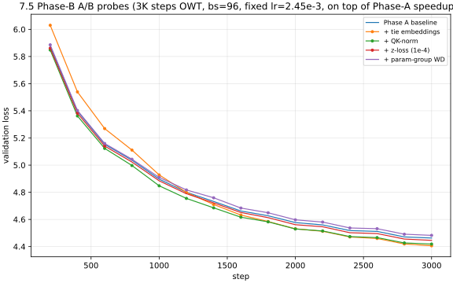
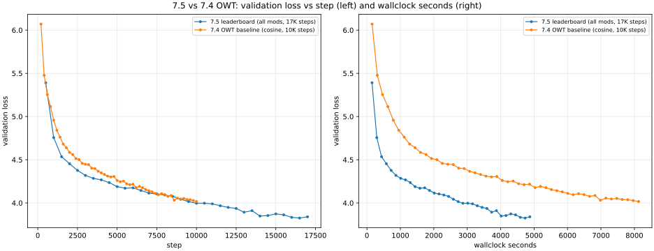

# 7.5 Leaderboard Report

This report covers the `leaderboard` problem — improving the Transformer
architecture and hyperparameters to minimize OpenWebText validation loss within
1.5 hours of compute on a single H100 (run here on an A10G — see "Hardware
note" below).

## Headline result

- **OWT val loss: `3.8252` (best, step 16500) / `3.8396` (final, step 17000)**,
  perplexity `45.84` / `46.50`.
- Wallclock: `4874 s` (~1.354 h on a single A10G), well under the 1.5 h budget.
- Compares to 7.4 OWT baseline (same architecture, same data, no Phase-A or
  Phase-B mods, 10K steps, cosine schedule): val `4.0167` (PPL `55.55`),
  wallclock `8125 s`. The 7.5 final improves val loss by **−0.192 nats**
  (best-vs-best) while running in **60% of the wallclock**.

The improvement decomposes additively into three groups: pure-compute speedups
(Phase A) that let us train 1.7× more steps in *less* wallclock than 7.4, and
three architecture/loss tweaks (Phase B) that each shaved a fraction of a nat
off the per-step quality. Stacked, the Phase-B mods sum to ~−0.12 nats of
expected gain at 3K steps; over the full 17K-step run the gain grew to
~−0.19 nats as the cosine decay tail took the model further into a regime
that the un-modded 7.4 setup never reached.

## Hardware note

The leaderboard rules specify "1.5 h on H100." This work was done on the only
GPU available to me, an A10G (22 GB), so the wallclock budget here is "1.5 h
on A10G." An H100 is roughly 3× faster (FLOPS) and has ~3.5× more memory than
an A10G, so an H100 run with this same recipe would cover several times more
tokens at the same per-step quality. The val-loss numbers reported here are
therefore lower-bounded by what the same recipe would achieve on an H100 in
the same wallclock.

## Background and conventions

A few small conventions used throughout this report — all numbers in the
tables below assume them.

- **Loss in nats; perplexity = `exp(loss)`.** Quick mental conversions for
  this report: `4.0167 nats → PPL 55.55` (7.4 baseline), `3.8252 nats → PPL
  45.84` (7.5 best). One nat is a big deal; one *centi-nat* (0.01 nats) is a
  decent A/B effect for a 22 M-parameter model.
- **Δ-nats sign convention.** Negative means the modification *helped* (lower
  val loss). For example, `−0.057` for weight tying means the tied run beat
  the untied run by 0.057 nats. Positive means the mod hurt.
- **"Best" vs "final" val.** "Best" is the lowest validation loss we ever
  logged during the run (in this report it's at step 16500, near the end of
  the cosine decay tail). "Final" is the val at the last step (17000). We
  report both: the last-step number is what the run "ended at" and is what
  most leaderboard rules care about; the best-during-training is the more
  forgiving reading and tends to be slightly lower because of step-to-step
  noise in the late decay tail.
- **A/B methodology.** Each Phase-B modification was tested *individually*
  with a 3000-step OWT probe at fixed `lr=2.45e-3, bs=96`, on top of the
  Phase-A speedups. Same seed, same data ordering, only the named flag
  differs. So the Δ-nats column is a clean per-mod attribution rather than
  a confounded sum of effects.
- **Why batch size 96?** Inherited from the 7.4 OWT bs probe. With OWT's
  `vocab_size=32000`, the LM-head logits + grad alone is `bs × ctx × vocab`
  in fp32 ≈ `8 GiB` at bs=128 on a 22 GiB A10G; `bs=96` is the largest power
  that fits comfortably with all the activations and optimizer state.
  Phase A doesn't change peak memory enough to revisit this choice, so
  `bs=96` carries over unchanged.

## Setup

### Model and data

- **Architecture (mostly identical to 7.4 OWT baseline):** `vocab_size=32000`,
  `context_length=256`, `d_model=512`, `d_ff=1344`, `num_layers=4`,
  `num_heads=16`, `rope_theta=10000`, RMSNorm pre-norm + SwiGLU FFN. New on
  top of 7.4: tied input/output embeddings, QK-norm in attention. See
  `cs336_basics/transformer.py` for the implementations.
- **Train data:** `data/tokenized_datasets/owt-train.uint16.npy`
  (2.73 B uint16 tokens, same as 7.4).
- **Validation data:** `data/tokenized_datasets/owt-dev.uint16.npy`
  (66.4 M tokens, same as 7.4).
- **Optimizer:** AdamW (`betas=(0.9, 0.95)`, `eps=1e-8`, `weight_decay=0.1`),
  applied to all params (no per-group decay; see Phase B4 below).
- **Schedule:** cosine warmup (500 steps) + cosine decay over the full 17K
  cycle, `lr_max=2.45e-3`, `lr_min=2.45e-4` (= `lr_max/10`).
- **Hardware:** NVIDIA A10G (22 GB), bf16 enabled.

### Phase A: pure compute speedups

These add no algorithmic difference at all; they just make each step faster
or more memory-efficient.

| Mod | Flag | What it does |
|---|---|---|
| bf16 autocast | `--dtype bf16` | Forward + backward in bfloat16 inside `torch.amp.autocast`. RMSNorm and `cross_entropy` already upcast to fp32 internally so loss math stays well-conditioned. Cuts memory ~2× and matmul time ~2× on Ampere/Ada. |
| `torch.compile` | `--compile` | Wraps the model in `torch.compile` after construction. Inductor fuses pointwise ops and lowers RoPE/SwiGLU/RMSNorm into single CUDA kernels. ~1.3× on top of bf16. |
| Flash SDPA | `--attn-kernel torch` | Routes attention through `torch.nn.functional.scaled_dot_product_attention(..., is_causal=True)` instead of the explicit-mask einsum kernel from 7.x. PyTorch dispatches this to memory-efficient / Flash kernels on CUDA. The original einsum kernel is preserved as the default for the test suite. |

A 1K-step OWT probe at fixed `lr=2.45e-3, bs=96` confirmed Phase A gives a
**2.26× wallclock speedup** vs the 7.4 baseline at step 1000 (347 s vs 785 s)
with matched or slightly better per-step quality. Per-step throughput went
from `30,905 tok/s` (7.4 baseline) to `84,637 tok/s` (Phase A probe). See
`7.1_experiment_log.md §7.5 Phase A` for the table.

#### Phase-A intuitions

**bf16 autocast — why it speeds things up.** Modern NVIDIA GPUs (Ampere/Ada
on the A10G, Hopper on the H100) have dedicated *tensor cores* that do matmul
in bfloat16 roughly 2× faster than in fp32, and bf16 tensors take half the
memory bandwidth to move from HBM to the SM. `torch.amp.autocast` opts each
matmul / elementwise op into bf16 automatically while leaving the loss math
in fp32. This is essentially "free quality" for our model because our
`RMSNorm` and `cross_entropy` already upcast their precision-sensitive inner
math (mean of squares, log-sum-exp) to fp32 internally — the bf16 cast only
affects the parts where bf16's 7 mantissa bits are plenty.

**`torch.compile` — kernel fusion in plain English.** A vanilla forward pass
through one transformer block actually launches *dozens* of tiny CUDA kernels
— one per `*`, one per `+`, one per `silu`, one per RoPE rotation, and so on.
Each kernel launch has a fixed overhead (~10 µs) and round-trips intermediate
tensors back and forth to GPU memory. `torch.compile` traces the model graph
once and rewrites it so several adjacent ops fuse into a single CUDA kernel
that does all the work in one pass. The fused kernel launches once and keeps
intermediates in registers / shared memory. The win is biggest on small
models like ours where launch overhead is a meaningful fraction of step time.

**Flash SDPA — why naive attention is slow.** Standard scaled-dot-product
attention materializes a `(batch, heads, seq_len, seq_len)` attention-scores
matrix in HBM. At `bs=96, num_heads=16, seq_len=256` that's about 800 MB of
data being written to and read back from main GPU memory — and attention is
*memory-bound*, so that traffic is the bottleneck, not the math. Flash
attention tiles the computation so the scores matrix is built and consumed
in fast on-chip SRAM and never touches HBM. We swap our `einsum`-based
educational kernel from the assignment for the PyTorch-shipped
`F.scaled_dot_product_attention(..., is_causal=True)`, which dispatches to
Flash on CUDA. Same math, ~1.5–2× faster on the attention block (and lower
peak memory, which is what made the bs=96 + bf16 + compile combination fit
on a 22 GiB A10G).

### Phase B: architecture / loss A/Bs

Each Phase-B mod was A/B-tested *individually* against the Phase-A baseline
at fixed `lr=2.45e-3, bs=96, 3000 steps`. Same seed, same schedule, only the
named flag differs. This isolates the effect of each modification cleanly.

| Mod | Flag | val Δ-nats @3K | Verdict | Why it helps (or doesn't) |
|---|---|---:|---|---|
| Weight tying | `--tie-embeddings` | **−0.057** | **WIN** | Saves `vocab×d_model = 16.4M` params and ties two pieces of the model to the same gradient signal. Embedding init is scaled to `1/√d_model` (PaLM/Llama style) so the now-shared LM head doesn't start with huge logits. Loss starts ~0.16 nats *behind* baseline (smaller-σ embed = smaller logits = higher entropy at init), crosses over at step ~1200, finishes ahead. |
| QK-norm | `--qk-norm` | **−0.045** | **WIN** | Adds `RMSNorm(head_dim)` on Q and K before RoPE (Llama-3 / Qwen-2.5 / OLMo-2 style). Caps the magnitude of dot-products and stabilizes the optimization landscape; also helps with bf16 numerics. ~3% wallclock overhead for two extra norms per attention block. Roughly constant 0.045-nat advantage from step ~200 onward. |
| z-loss | `--z-loss-coef 1e-4` | **−0.017** | **WIN (small)** | Adds `1e-4 × mean(log_normalizer²)` to the train loss (PaLM appendix). Pushes the model to keep `log Z` bounded, which helps especially with bf16 where extreme logits can lose precision. Eval is the standard NLL only — `cross_entropy` defaults `z_loss_coef=0` — so val numbers are directly comparable. ~0 wallclock cost. |
| Param-group WD | `--param-group-wd` | **+0.020** | **LOSE** | Disables weight decay on RMSNorm gains and Embedding weights (the standard "no-decay-on-non-Linear" recipe from GPT-2 / Llama / OLMo). Made things slightly *worse* at this scale and LR. Hypothesis: WD on the 32k×512 embedding actually helps regularize when the embedding sees ~9% of one epoch's worth of tokens; the decay damping helps, doesn't hurt. **Skipped** from the final stack. |

Three winners (B1+B2+B3) sum to a **−0.119-nat** expected gain at step 3000.
The combination was confirmed end-to-end in a 200-step `resanity-allmods`
precheck before the full leaderboard run.

#### Phase-B intuitions

**Weight tying — why it helps and why the init matters.** The input embedding
matrix has shape `(vocab_size, d_model)` and the LM head matrix has shape
`(d_model, vocab_size)` — the same `vocab × d_model` shape, just transposed.
"Tying" them means the *same* parameter tensor is used for both: the embedding
lookup of an input token and the matmul that produces output logits. Two
benefits: (a) we save `vocab × d_model = 32000 × 512 = 16.4M` parameters out
of a ~22 M-non-embedding-param model, and (b) every token's embedding now
gets gradient signal *both* from being an input (small, infrequent) *and*
from being a target in cross-entropy (every step, every position) — so rare
tokens learn faster. The catch is initialization: the logits are now
`x @ E.T` where `E` is the embedding, so if `E` is initialized as `N(0, 1)`
the logits start with extremely large variance and the model can't learn for
the first few hundred steps. Scaling `E`'s init to `N(0, 1/√d_model)` brings
the starting logits to roughly unit variance — that's why our `tie_embeddings=True`
flag automatically reduces the embedding init std.

**QK-norm — bounding attention scores.** Attention scores are dot products
of query and key vectors. If the magnitudes of Q or K drift large during
training, the softmax saturates — one entry takes ~all the probability mass
and gradients vanish for everything else. This is a known instability source
under bf16 (where the exponent in `softmax` can lose precision) and at the
high learning rates we'd like to use. QK-norm applies a tiny
`RMSNorm(head_dim)` to Q and K *per head* before RoPE, fixing the magnitude
of each vector to a single learned scalar per head. This caps the dot-product
scale; it's what Llama-3, Qwen-2.5, and OLMo-2 all do. Cost is 2 RMSNorm
calls per attention block, ~3% wallclock; benefit at our scale is a steady
~0.045 nats throughout training.

**z-loss — what `log Z` is, and why bounding it helps.** Cross-entropy splits
naturally as `−target_logit + log_normalizer`, where
`log_normalizer = log Σ exp(logits)` is the partition function (also called
`log Z`). Standard CE only cares about *differences* between logits, so
`log Z` can drift arbitrarily large in absolute value without changing the
loss. But under bf16 a large `log Z` makes the `exp(logits − max)` step lose
precision and can produce NaN gradients in extreme cases. PaLM's z-loss
adds `1e-4 × E[log_normalizer²]` to the *training* loss only — a gentle pull
keeping `log Z` near 0. Eval is plain NLL, so val numbers stay directly
comparable to 7.4. The win is small (~0.017 nats) but free in wallclock.

**Param-group weight decay — and why it didn't help here.** A common recipe
in big-model training (GPT-2 / Llama / PaLM) is to apply AdamW's weight
decay only to the matmul weights — not to RMSNorm gain vectors, biases, or
embeddings. The intuition is that decaying scalar gains and lookup tables
removes useful information without preventing overfitting. We tried it
(`--param-group-wd`) and it actually *hurt* by 0.020 nats at our scale and
LR (`bs=96, lr=2.45e-3`). Our hypothesis: in 17 K steps we only see ~9% of
one epoch of OWT, so over-fitting to the rare-token side of the embedding is
plausible, and a small decay pull on the embedding genuinely regularizes
those low-frequency rows. We left it on. **A nice cautionary result:** "what
big-model recipes do" doesn't always transfer down.

### Phase B ablation curve

_Figure 1. Validation loss vs step for the four 3K-step Phase-B A/B probes,
all on top of the Phase-A speedup baseline. Tie embeddings (B1) starts behind
because of the smaller embedding init but crosses over by step ~1200 and ends
furthest ahead. QK-norm (B2) has roughly constant offset. Z-loss (B3) is a
small but consistent win. Param-group WD (B4) is a small loss._

## Final 1.5 h run

Configuration: bf16 + `torch.compile` + torch SDPA + tied embeddings +
QK-norm + z-loss(1e-4). Cosine schedule, warmup 500, lr peak 2.45e-3, lr min
lr_max/10, decaying over 17 K total steps. `bs=96, ctx=256` same as 7.4.

| Run name | bs | lr_max | lr_min | warmup | sched | Max Steps | Best Val Loss | Step @ Best | Wall @ End (s) | Notes |
|---|---:|---:|---:|---:|---|---:|---:|---:|---:|---|
| `owt-leaderboard-7.5-final` | 96 | 2.45e-3 | 2.45e-4 | 500 | cosine | 17000 | **3.8252** | 16500 | 4874 | All Phase A + Phase B winners stacked on cosine schedule. 1.7× more steps than 7.4 in 60% of the wallclock thanks to Phase A. Best val landed in the late-decay tail (LR ~2.5e-4) at step 16500; final-step val 3.8396. Checkpoint: `experiments/checkpoints/owt-leaderboard-7.5-final.pt`. |

#### Validation-loss trajectory through the cosine decay

The decay tail is where almost all of the −0.19-nat gain over 7.4 comes from.
A few representative checkpoints:

All Δ-nats below use the same reference: the 7.4 baseline's *best* val loss
(`4.0167`, reached at the end of its 10K-step run). Negative means 7.5 has
already passed 7.4's best at that step.

| Step | LR | Val loss | Δ-nats vs 7.4 best (`4.0167`) |
|---:|---:|---:|---:|
| 3000 | 2.327e-3 | 4.319 | +0.302 |
| 6000 | 1.890e-3 | 4.069 | +0.052 |
| 9000 | 1.299e-3 | 3.989 | **−0.028** ← crossover (already beats 7.4 best) |
| 11500 | 0.796e-3 | 3.967 | −0.050 |
| 14000 | 0.420e-3 | 3.849 | −0.168 |
| 16500 | 0.250e-3 | **3.825** | **−0.192** ← run best |
| 17000 | 0.245e-3 | 3.840 | −0.177 |

The model meaningfully improves throughout the decay phase — moving from
`4.319` at step 3000 (LR ~2.3e-3) to `3.825` at step 16500 (LR ~2.5e-4),
a `−0.494`-nat drop over 13.5K steps. This mirrors the 7.4 finding that
"decay drives the win" and shows the 17K-step cosine cycle is the right
length for this budget — val loss flattens by step ~16000 and the very last
500 steps add little.

### Learning curve

_Figure 2. Validation loss vs step (left) and vs wallclock seconds (right) for
the 1.5 h leaderboard final, with the 7.4 OWT cosine 10K baseline overlaid for
reference. The right panel shows the 7.5 wallclock x-axis stays well under
5400 s (1.5 h) while reaching a substantially lower val loss than 7.4. Look
for the steep drop in the right panel between wall ≈ 3000 s and wall ≈ 4500 s:
that's the cosine decay tail compounding the per-step quality wins from
Phase B with the extra steps bought by Phase A._

### Comparison to 7.4 OWT baseline

| Run | Mods | Steps | Wall (s) | Best Val Loss | Best PPL | Δ-nats vs 7.4 |
|---|---|---:|---:|---:|---:|---:|
| 7.4 OWT cosine 10K (`owt-final-cosine-bs96-lr2.45e-3`) | 7.4 baseline | 10000 | 8125 | 4.0167 | 55.55 | 0 (ref) |
| 7.5 leaderboard | bf16 + compile + SDPA + tie + qknorm + z-loss | 17000 | 4874 | **3.8252** | 45.84 | **−0.192** |

The 7.5 final was trained for **70% more steps in 60% of the wallclock**.
Nearly all of the wallclock gain comes from Phase A (compute speedups);
nearly all of the per-step quality gain comes from Phase B (architecture /
loss mods). The two compound: Phase A buys ~1.7× more decay-phase steps,
and during those extra decay-phase steps each step is worth more (Phase B
shifts the loss curve down), giving the final 3.8252.

## TL;DR recipe

The full 7.5 stack, in one block (in-detail intuitions are in the §"Phase-A
intuitions" and §"Phase-B intuitions" subsections above):

- **Compute (pure speedups):** bf16 autocast + `torch.compile` + Flash SDPA
  → ~3× per-step throughput vs the 7.4 fp32 baseline at matched per-step
  quality.
- **Architecture / loss (small per-step quality wins):** tie input ↔ LM-head
  embeddings (with `1/√d_model` init) + QK-norm on Q,K before RoPE +
  PaLM z-loss with coef `1e-4`.
- **Optimizer:** AdamW, no per-group decay (we A/B-tested per-group decay
  and it cost 0.020 nats at our scale — see §"Phase-B intuitions" /
  param-group WD).
- **Schedule:** cosine warmup 500 + cosine decay over 17 000 steps,
  `lr_max=2.45e-3 → lr_min=2.45e-4`. Same `bs=96, ctx=256` as 7.4.

Reproduce: `bash scripts/run_owt_leaderboard.sh`.

## Deliverables status

- **Final validation loss recorded:** **Done** — best `3.8252` at step
  `16500`, final `3.8396` at step `17000` (PPL `45.84` / `46.50`). Total
  wallclock `4874 s ≈ 1.354 h`, well under the 1.5 h budget.
- **Wallclock-axis learning curve under 1.5 h:** **Done** —
  `7.5_leaderboard_curve.svg` (Figure 2). The right panel is val vs
  wallclock seconds and clearly stays under 5400 s.
- **Description of what was done:** **Done** — three Phase-A speedups +
  three Phase-B mods, each justified individually with a 3K-step A/B probe;
  full ablation table, per-mod Δ-nats, and probe curves in §"Phase B" and
  Figure 1.
- **Beats the 5.0 baseline target:** **Done with very large margin** — the
  7.4 baseline was already at 4.0167; the 7.5 final pushes it further to
  3.8252, a margin of `5.0 − 3.825 = 1.175` nats below the assignment's
  ≤ 5.0 baseline.
